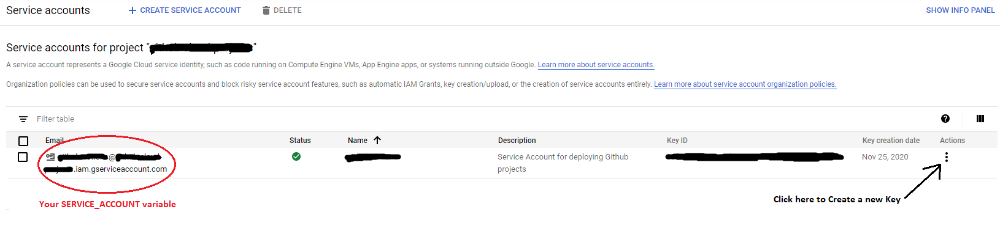
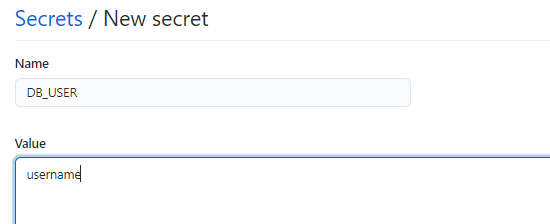
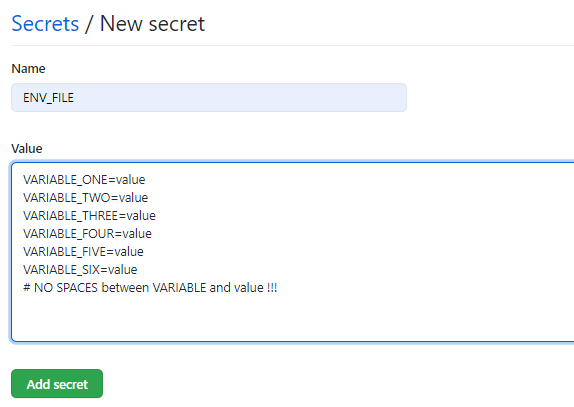

# Google Cloud Deploy Tutorial
## Deploying a Fullstack React App + Express.js + MySQL
### Automatically Deploy on every event (default is push) to the branch of your choice.


## steps:
1. Create a Google Cloud Project -> use your free trial and make sure the account has billing. 
2. Create a Service Account User :
    - Go to the I AM & ADMIN -> Service Accounts -> Create Service Account
    - Give it a name and Add the following Roles :
        1. Compute Admin
        2. Compute Instance Admin (v1)
        3. Service Account User
        4. Storage Admin  
        

3. Create a Key for the service account you've created -> Select in JSON format.
    1. Change filename to "key.json" and use your terminal cd into the folder where your key was downloaded.
    2. Encrypt the file -> 
    - windows: `certutil -encode key.json tmp.b64 && findstr /v /c:- tmp.b64 > key.b64`
    - linux: `	base64 key.json > key.b64`
    - macOs: `	base64 -i key.json -o key.b64`
4. Head over to your repository on github, go to Settings -> Secrets and ADD the following Secrets :
(In this Format)
 
- DB_HOST -> MySql Host name (of your choice)
- DB_PASS -> MySql Password (of your choice)
- DB_NAME -> MySql Database (of your choice)
- DB_USER -> MySql User (of your choice)
- GOOGLE_APPLICATION_CREDENTIALS -> Paste the contents of your key.b64 file
- PROJECT_ID -> Your project id 
- SERVICE_ACCOUNT -> The full email that represents your service account
- ENV_FILE -> If needed: PASTE the contents of your .env file ( All additional secrets your project needs )  
* Do not override database variables in ENV_FILE.



<a href="https://console.cloud.google.com/flows/enableapi?apiid=containerregistry.googleapis.com,compute.googleapis.com">Enable Compute Engine API + Container Registry For Your Project</a>

open your project in vscode, in your root directory run ->  
` git clone https://github.com/ZBejavu/gcloud-deploy-tutorial.git `

## Adaptations :
- Copy -> into your project root folder :
    - .github folder with its contents
    - Dockerfile, docker-compose, Makefile, .dockerignore
- Create a script in your Server Package.json file as described in the Dockerfile.
- Configure Your Sequelize Config as Shown in the examples/config folder
- MAKE SURE your server Serves the Build files as Shown in the examples/server/app.js
- Specify in Docker-Deploy.yml :
    1. The Deploy Branch (deploy will happen when you push to that branch)
    2. Name your Instance (GCE_INSTANCE Variable)
    3. Enter your SERVER_PORT
- If you Added ENV_FILE -
    - Unmark Steps In Docker-Compose.yml That are titled 'Enable when using ENV_FILE'
    - Add the line `--env-file=.env \` in Makefile as Specified (line 49)
- Delete the 'gcloud-deploy-tutorial' directory when you've finished setting up.

** The Dockerfile and workflow were both made for client folder named 'client' and server folder named 'server'  
** Change folder names if necessary, update Port number in the Dockerfile, compose file and Workflow file if needed.

### Check To see Your Containerised app works :
- In your client folder: 
    - `npm ci --only=production`
    - `CI=false INLINE_RUNTIME_CHUNK=false npm run build`
- In your root folder:
    - `docker-compose build && docker-compose up`

## Commit + Push to github, Watch Your Workflow in Actions tab 
*** <b>(push changes to MASTER / the branch you want the deploy to happen at )</b>  
Visit Compue Engine -> VM Instances to view your app when workflow finished succesfully  
visit the external-ip:yourportnumber to view your application

### After instance Creation & Firewall Rule Creation -
- Mark out the Firewall Rule in Docker-Deploy.yml
- Mark out the 'Create instance' in Docker-Deploy.yml
- Mark out the 'Initialize Environment' in Docker-Deploy.yml  
** these steps are only designed for first time use.

``` yml
    # # Create a new instance -> MARK IT OUT AFTER FIRST DEPLOY
    # - name: Create Instance #for first time setup
    #   run: make create

    # # Create Rule To allow access to the port your app is running on.

    # # ONLY INCLUDE if it doesnt already exist for SERVER_PORT !!
    # - name: Create Firewall Rule
    #   run: make create-firewall-rule
    .
    .
    .
    # # ONLY first time setup
    # # Initialize Envoironment in Gcloud Instance
    # - name: Initialize volumes, network and other Containers that don't change
    #   run: make initialize
```

** Friendly tip : Make sure all migration table names are consistent.

## Resources:

[https://www.youtube.com/watch?v=OXE2a8dqIAI&t=2637s](https://www.youtube.com/watch?v=OXE2a8dqIAI&t=2637s) - Great Video, Understanding the Docker-Deploy.yml file, Makefile

[https://cloud.google.com/sdk/gcloud/reference/compute/instances/create](https://cloud.google.com/sdk/gcloud/reference/compute/instances/create) - Instance create documentation

[https://github.com/google-github-actions/setup-gcloud](https://github.com/google-github-actions/setup-gcloud) - gcloud @action documentation

[https://www.youtube.com/watch?v=0B2raYYH2fE&t=232s](https://www.youtube.com/watch?v=0B2raYYH2fE&t=232s) - Quick docker-compose explanation